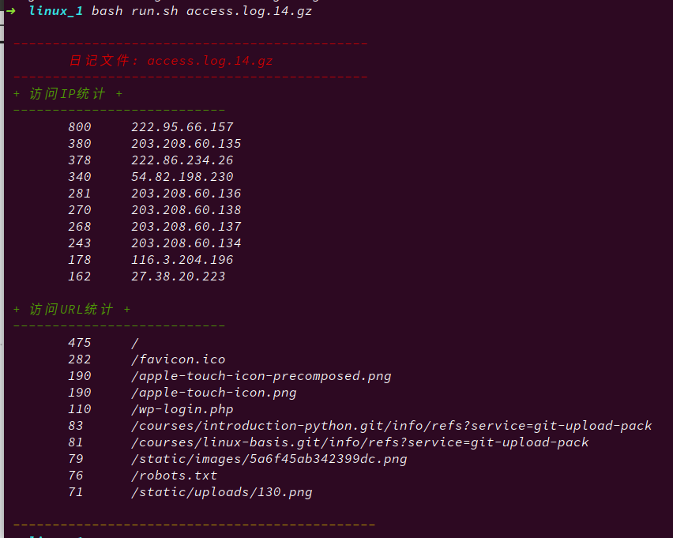

**基于nginx的log日记分析：**

----

获取访问最多的N个IP列表

获取访问最多的N个URL列表

------------

**要求：**

模块化。不要把代码堆到一个Bash脚本里面，用模块化的思路提高代码的可维护性和可扩展性。

可配置。也就是支持配置文件，支持颜色配置。

思路：

1. conf.sh：支持配置文件
2. function.sh：主要处理log日记的文件
3. report.sh：配置输出格式文件
4. bash_colors.sh：改变终端颜色文件<u><font size=3.5>*[引用别人现成的脚本，不需重新造轮子](https://github.com/mercuriev/bash_colors/blob/master/bash_colors.sh)*</font></u>

------

<center><font size=5 color=red>Code</font></center>
查看一下access.lot.14.gz日记的格式
``` shell
zcat access.log.14.gz|head -5
```
```txt
222.95.66.157 - - [06/Jun/2018:06:25:11 +0800] "GET /socket.io/?EIO=3&transport=polling&t=MFI3MYy&sid=-B30Ehmw3iCifta5ADUu HTTP/1.1" 200 3 "https://talk.pycourses.com/recent" "Mozilla/5.0 (Macintosh; Intel Mac OS X 10_13_4) AppleWebKit/537.36 (KHTML, like Gecko) Chrome/66.0.3359.181 Safari/537.36" "-"
222.95.66.157 - - [06/Jun/2018:06:25:11 +0800] "POST /socket.io/?EIO=3&transport=polling&t=MFI3TCh&sid=-B30Ehmw3iCifta5ADUu HTTP/1.1" 200 2 "https://talk.pycourses.com/recent" "Mozilla/5.0 (Macintosh; Intel Mac OS X 10_13_4) AppleWebKit/537.36 (KHTML, like Gecko) Chrome/66.0.3359.181 Safari/537.36" "-"
54.82.198.230 - - [06/Jun/2018:06:25:28 +0800] "GET /post/57 HTTP/1.1" 302 74 "-" "MauiBot (crawler.feedback+wc@gmail.com)" "-"
222.95.66.157 - - [06/Jun/2018:06:25:38 +0800] "GET /socket.io/?EIO=3&transport=polling&t=MFI3TDe&sid=-B30Ehmw3iCifta5ADUu HTTP/1.1" 200 3 "https://talk.pycourses.com/recent" "Mozilla/5.0 (Macintosh; Intel Mac OS X 10_13_4) AppleWebKit/537.36 (KHTML, like Gecko) Chrome/66.0.3359.181 Safari/537.36" "-"
222.95.66.157 - - [06/Jun/2018:06:25:38 +0800] "POST /socket.io/?EIO=3&transport=polling&t=MFI3Ztm&sid=-B30Ehmw3iCifta5ADUu HTTP/1.1" 200 2 "https://talk.pycourses.com/recent" "Mozilla/5.0 (Macintosh; Intel Mac OS X 10_13_4) AppleWebKit/537.36 (KHTML, like Gecko) Chrome/66.0.3359.181 Safari/537.36" "-"
```

**get_ip:**
获取ip列
``` shell
zcat access.log.14.gz|awk '{ print $1 }' | head -5
```
```txt
222.95.66.157
222.95.66.157
54.82.198.230
222.95.66.157
222.95.66.157
```

**get_top_ip:**
获取前五IP

```shell
zcat access.log.14.gz|awk '{ print $1 }' | sort | uniq -c | sort -rn | head -5
```
```txt
800 222.95.66.157
380 203.208.60.135
378 222.86.234.26
340 54.82.198.230
281 203.208.60.136
```

**get_top_url:**
获取前五URL

```shell
zcat access.log.14.gz|awk '{ print $7 }' | sort | uniq -c | sort -rn | head -5
```
```txt
475 /
282 /favicon.ico
190 /apple-touch-icon-precomposed.png
190 /apple-touch-icon.png
110 /wp-login.php
```

---
### *result*

