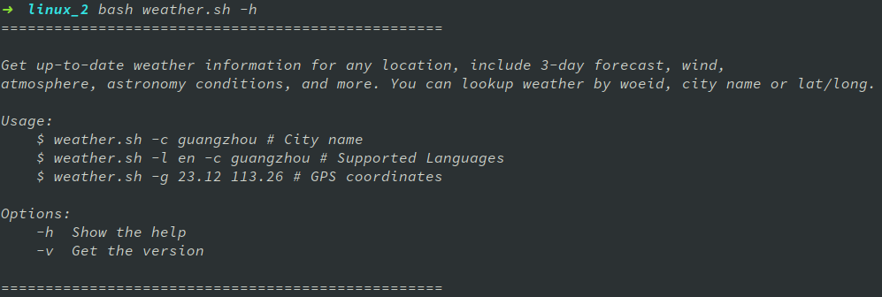
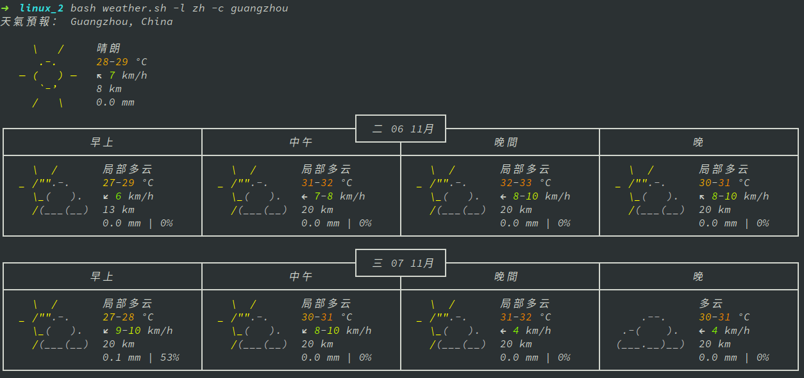

##### 用shell语言连接[wttr.in](http:wttr.in)API,查询天气
----

本例只支持 -g(经纬度) -c(城市字) 和-l（Lang)，效果如下

*print  help  message*

*print  weather*

-----

**思路**

- 使用curl，wget，httpie。连接[wttr.in](http:wttr.in)
- 用shell语言解析参数。
- 返回结果